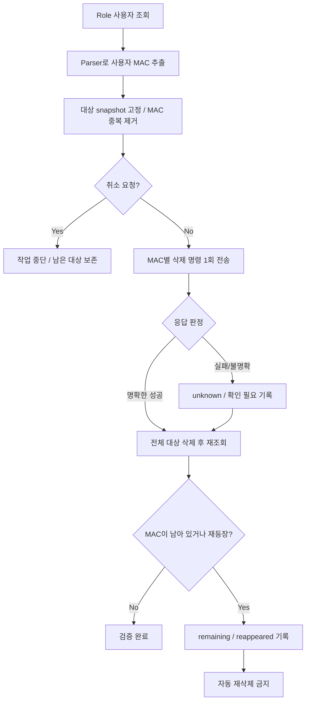
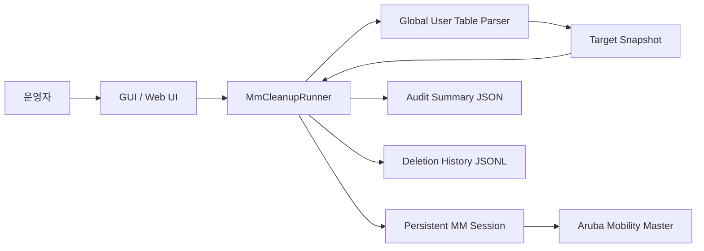

# Aruba MM Session Cleanup — 안전 지향 사용자 세션 정리 자동화

[](https://github.com/sebia1993/Aruba_MM/actions/workflows/pr-validation.yml)

**Aruba Mobility Master/MM에서 특정 Role 사용자 세션을 조회하고, 조회 시점에 확정된 MAC만 대상으로 정리 명령을 수행한 뒤 사후 재조회로 결과를 검증하는 Windows 네트워크 운영 자동화 도구입니다.**

이 프로젝트는 `aaa user delete mac <mac>`처럼 실제 장비 상태를 변경하는 명령을 사용합니다. 그래서 단순한 일괄 삭제보다 **대상 고정, 중복 제거, blind retry 금지, 사후 검증, 재등장 MAC 자동 재삭제 금지**를 핵심 설계 원칙으로 둡니다.

> 실제 장비에서 사용하면 사용자 세션이 삭제됩니다. 반드시 허가된 운영 환경과 승인된 절차에서만 사용하십시오. 자동 테스트와 공개 문서는 fixture·fake connection·비식별 데이터만 사용합니다.

## Portfolio Snapshot

| 관점 | 구현 내용 |
|---|---|
| 운영 문제 | 특정 Role에 남은 사용자 세션을 사람이 조회·복사·삭제·재확인하는 반복 작업을 자동화 |
| 변경 안전성 | 최초 조회 결과를 immutable target snapshot으로 고정하고 이후 새로 나타난 MAC을 삭제 대상에 자동 포함하지 않음 |
| 중복·재시도 제어 | MAC 정규화/deduplication 적용, 상태 변경 명령은 blind retry하지 않아 중복 실행 위험 억제 |
| 성공 판정 | CLI 응답만 신뢰하지 않고 삭제 후 동일 Role을 다시 조회해 실제 잔존 여부까지 검증 |
| 불확실성 처리 | 응답 유실·검증 실패는 성공으로 추정하지 않고 `unknown / 확인 필요` 상태로 보존 |
| 감사 가능성 | 실행 요약 JSON과 MAC별 JSONL 이력을 남기되 전체 raw 장비 출력은 장기 저장하지 않음 |
| 배포·검증 | Windows GUI/Web 통합 패키지, pytest/compile/package check, GUI/Web smoke와 release verifier 구성 |

**기술 스택:** Python · SSH/CLI automation · Windows GUI · local Web UI · pytest · JSON/JSONL · GitHub Actions · Windows packaging

이 프로젝트의 핵심은 단순 삭제 자동화가 아니라 **실제 장비 상태를 변경하는 네트워크 자동화에서 대상 결정, idempotency 한계, 불확실한 응답, 사후 검증을 어떻게 안전하게 다룰지 설계한 것**입니다.

## 한눈에 보기

| 항목 | 내용 |
|---|---|
| 대상 | Aruba Mobility Master / MM |
| 기본 Role | `profiling` |
| 조회 | `show global-user-table list role <role>` |
| 변경 명령 | `aaa user delete mac <mac>` |
| 대상 결정 | **최초 조회 snapshot에서 파싱된 사용자 MAC만** 사용 |
| 중복 처리 | 정규화 MAC 기준 1회만 실행 |
| 삭제 명령 재시도 | **하지 않음** (`retry_once=False`) |
| 성공 판정 | 명령 응답 + 삭제 후 재조회 결과를 함께 사용 |
| 응답 불명확 | `확인 필요 / unknown`으로 보존 |
| 재등장 MAC | `reappeared`로 기록, 자동 재삭제하지 않음 |
| 취소 | 삭제 전 countdown, MAC 간 경계, 검증 조회 전 반영 |
| 감사 자료 | 요약 JSON + 삭제 이력 JSONL |
| raw 장비 출력 | 장기 저장하지 않음 |
| 실행 경로 | Windows GUI / portable Web UI |
| 배포 | Python 없이 실행 가능한 Windows 통합 ZIP |

## 해결하려 한 운영 문제

특정 Role에 잘못 남아 있는 사용자 세션을 정리할 때 운영자가 직접 MM에 접속해 MAC을 확인하고 하나씩 삭제하면 다음 문제가 생길 수 있습니다.

- 조회 중 목록이 변해 **처음 확인하지 않은 MAC을 실수로 삭제**할 위험
- 같은 MAC이 여러 줄에 나타나 **중복 삭제 명령**이 실행될 위험
- 장비가 명령을 처리했지만 응답만 유실된 상황에서 **자동 재시도로 동일 변경을 반복**할 위험
- CLI 응답만 보고 성공으로 판단해 실제 세션 잔존 여부를 놓치는 문제
- 삭제 직후 다시 나타난 MAC을 무조건 재삭제해 원인 분석 기회를 잃는 문제
- 장시간 반복 실행에서 결과·감사 이력이 불명확해지는 문제

이 도구는 이를 **“조회 결과를 변경 대상 snapshot으로 고정하고, 변경 명령은 한 번만 전송하며, 별도 검증 조회로 최종 상태를 확인한다”**는 방식으로 다룹니다.

## 안전 실행 흐름



### 1. 삭제 대상은 최초 조회에서만 결정

조회 명령은 다음과 같습니다.

```text
show global-user-table list role <role>
```

Parser가 사용자 MAC으로 판단한 값만 삭제 snapshot에 들어갑니다. BSSID/AP 등 다른 컬럼의 MAC-like 값은 삭제 대상으로 사용하지 않습니다. 동일 MAC이 여러 번 보이더라도 정규화 후 한 번만 처리합니다.

### 2. 변경 명령은 blind retry 하지 않음

```text
aaa user delete mac <mac>
```

삭제 명령은 응답 실패 시 자동 재전송하지 않습니다. 네트워크 timeout이나 세션 단절이 **“명령 미실행”을 의미하지 않기 때문**입니다. 장비에서 이미 삭제가 처리됐는데 응답만 유실된 경우 같은 명령을 다시 보내는 것을 방지합니다.

### 3. 응답만으로 최종 성공을 확정하지 않음

삭제 배치가 끝나면 같은 Role 조회를 다시 수행합니다. 삭제 응답이 성공이었고 검증 조회에서 MAC이 사라진 경우에만 최종 성공으로 판단합니다.

응답 실패·파싱 불확실성·검증 미완료는 정상 성공으로 승격하지 않고 `확인 필요` 상태로 남깁니다.

### 4. 재등장 MAC을 자동으로 다시 삭제하지 않음

삭제 성공으로 판단했던 MAC이 검증 조회에서 다시 나타나면 `reappeared_macs`로 기록합니다. 이 상태는 인증 재시도, 외부 정책, 단말 재접속 등 별도 원인 확인이 필요할 수 있으므로 자동 재삭제하지 않습니다.

자세한 안전 상태 모델은 [SAFETY_MODEL.md](docs/SAFETY_MODEL.md)를 참고하십시오.

## 아키텍처



구성요소와 데이터 경계는 [ARCHITECTURE.md](docs/ARCHITECTURE.md)에 정리했습니다.

## 운영 안전 장치

| 위험 | 대응 |
|---|---|
| 조회 후 대상이 바뀜 | 최초 조회 snapshot에서 대상 MAC을 고정 |
| 중복 MAC | 정규화 후 dedupe |
| 명령 응답 유실 | 삭제 명령 자동 재시도 금지 |
| 삭제가 실제 반영되지 않음 | 사후 재조회로 검증 |
| 삭제 직후 MAC 재등장 | 기록만 하고 자동 재삭제 금지 |
| 사용자 중단 요청 | 삭제 전·MAC 간·검증 전 취소 경계 확인 |
| Parser가 다른 MAC-like 값을 오인 | 사용자 MAC으로 판정된 항목만 채택 |
| 장비 raw 출력 노출 | 감사 파일에는 구조화 결과와 parser 판단만 기록 |
| 감사 파일 저장 실패 | 네트워크 작업 결과와 분리해 warning 처리 |

## 결과와 감사 이력

실행 결과는 UI에서 대상별 상태로 확인할 수 있으며 결과 폴더에는 구조화된 감사 자료가 생성됩니다.

```text
outputs/
├─ <run-directory>/
│  └─ cleanup_summary.json
└─ deletion_history.jsonl
```

`cleanup_summary.json`에는 조회·삭제·검증 결과와 parser 선택/제외 판단을 기록합니다. `deletion_history.jsonl`은 MAC별 실행 결과를 누적합니다. 장비의 전체 raw CLI 출력은 저장하지 않습니다.

## Windows 사용

GitHub Release의 통합 ZIP을 내려받아 압축 해제합니다.

```text
README_START_HERE_KO.txt
gui/
  ArubaMMCleanupGUI.exe
web/
  ArubaMMCleanupWeb.exe
  start_webapp.cmd
```

GUI:

```text
gui\ArubaMMCleanupGUI.exe
```

웹 UI:

```text
web\start_webapp.cmd
```

웹 UI 기본 바인딩은 `127.0.0.1:8765`입니다. 외부 인터페이스에 공개하는 용도로 설계하지 않았습니다.

자세한 사용법은 [USER_GUIDE_KO.md](docs/USER_GUIDE_KO.md)를 참고하십시오.

## 검증 체계

PR 검증은 Windows runner에서 다음 흐름을 수행합니다.

```text
validation
   ↓
pytest / compile / package checks
   ↓
Windows GUI + Web 통합 패키지 빌드
   ↓
GUI smoke
   ↓
Web smoke
   ↓
release package verifier
```

실제 MM에 접속하는 검증과 자동 테스트는 분리합니다. CI는 fake connection과 fixture만 사용하며 실제 운영 세션을 삭제하지 않습니다.

상세한 검증 범위와 “자동 검증으로 증명할 수 없는 것”은 [VALIDATION_REPORT.md](docs/VALIDATION_REPORT.md)를 참고하십시오.

## 로컬 개발

```powershell
python -m pip install -e ".[dev]" -c .\constraints.txt
python -m pip check
python -m pytest
python -m compileall src
```

Windows 패키지 검증:

```powershell
powershell -NoProfile -ExecutionPolicy Bypass -File .\tools\validate.ps1
powershell -NoProfile -ExecutionPolicy Bypass -File .\build_windows_gui_exe.ps1
python .\tools\verify_release_package.py --dist .\dist --smoke-gui --smoke-web --require-gui-smoke --require-web-smoke
```

개발·변경 원칙은 [DEVELOPMENT.md](DEVELOPMENT.md)를 참고하십시오.

## 범위 밖

이 프로젝트는 다음을 목표로 하지 않습니다.

- 사용자 세션 삭제 외의 MM 설정 변경 자동화
- 삭제 명령의 무조건 재시도
- 재등장 MAC의 자동 반복 삭제
- raw 장비 출력의 장기 저장
- 인터넷 공개형 Web UI
- 승인되지 않은 운영 환경에서의 자동 실행

## 보안

실제 장비 주소, 계정, 암호, MAC, 내부 Role 이름, 운영망 출력은 공개 저장소에 올리지 않습니다. 취약점이나 민감정보 노출 문제는 공개 이슈에 원문 데이터를 첨부하지 말고 [SECURITY.md](.github/SECURITY.md)의 기준을 따라야 합니다.