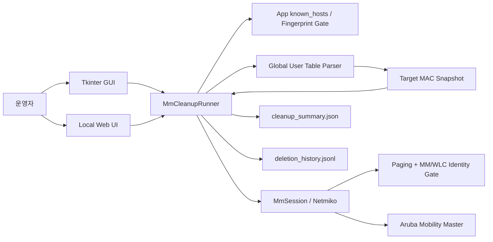

# Aruba MM Session Cleanup 아키텍처

## 목적

이 문서는 Aruba MM Session Cleanup의 구성요소, 데이터 흐름, 상태 소유권을 설명합니다. 핵심은 **조회 결과와 변경 대상의 경계를 분리하고, 장비 변경 명령을 안전하게 제어하는 것**입니다.

## 구성요소



### UI 계층

GUI와 Web UI는 운영 입력과 진행 상태를 표시합니다. 네트워크 명령 조합과 최종 판정은 UI가 직접 수행하지 않고 `MmCleanupRunner`에 위임합니다.

### Runner

`MmCleanupRunner`는 한 번의 작업을 다음 단계로 분리합니다.

1. Role 조회
2. Parser 결과에서 사용자 MAC 추출
3. 정규화·중복 제거 후 target snapshot 고정
4. snapshot 미리보기와 명시 승인
5. 삭제 전 countdown / 취소 확인
6. MAC별 삭제 명령 한 번 전송
7. 전체 삭제 단계 종료 후 검증 조회
8. 결과 상태 갱신
9. 감사 요약·이력 저장

### Parser

Parser는 `show global-user-table list role <role>` 출력에서 사용자 항목을 식별합니다. 삭제 대상으로 채택한 이유와 제외한 이유는 구조화된 parse decision으로 보존할 수 있지만 raw 장비 출력 자체를 장기 감사 자료로 저장하지 않습니다.

### Session

`MmSession`은 Netmiko 기반 MM/WLC 연결을 담당합니다. 운영 연결은 앱 전용 known_hosts의 승인된 키를 강제하고, 연결 직후 `no paging`과 `show version` 신원 게이트를 통과해야 합니다. GUI에서는 같은 접속 정보에 대해 세션을 재사용할 수 있지만, 변경 명령의 재시도 여부는 상위 Runner가 명시적으로 제어합니다.

## 데이터 흐름

### 조회 단계

```text
MM output
  ↓
parser
  ↓
UserEntry 목록
  ↓
MAC normalize
  ↓
dedupe
  ↓
Target Snapshot
```

삭제 단계는 이후 장비 조회 결과를 새 대상 목록으로 사용하지 않습니다. **한 실행에서 삭제 대상은 최초 snapshot으로 고정**됩니다.

### 삭제·검증 단계

```text
Target Snapshot
  ↓
MAC #1 delete (1회)
  ↓
MAC #2 delete (1회)
  ↓
...
  ↓
Role 재조회
  ↓
absent / remaining / reappeared 판정
```

## 상태 소유권

| 상태 | 소유 위치 | 비고 |
|---|---|---|
| MM 접속 정보 | UI/runtime | 공개 저장소에 포함하지 않음 |
| SSH 서버 공개키 | 앱 known_hosts | 최초 명시 승인, 변경 시 차단 |
| 대상 MAC snapshot | Runner 실행 메모리 | 최초 조회로 고정 |
| 삭제 결과 | Runner 실행 메모리 | MAC별 상태 |
| 감사 요약 | 결과 폴더 JSON | 구조화 정보 |
| 삭제 이력 | 결과 폴더 JSONL | 실행 간 누적 가능 |
| raw CLI 출력 | 저장하지 않음 | parser 입력으로만 사용 |

## 실패 격리

네트워크 변경 결과와 로컬 파일 저장 결과는 분리합니다. 감사 JSON 저장 실패가 이미 수행된 네트워크 변경을 되돌리거나 재실행시키지 않습니다. 저장 실패는 warning으로 남기며, 변경 명령을 다시 보내는 근거로 사용하지 않습니다.

## 운영 경계

- MM 명령을 임의로 구성하지 않고 코드가 정한 조회/삭제 형태를 사용합니다.
- Role과 접속 입력은 제한된 형식만 허용합니다.
- 페이징 해제와 MM/WLC 신원 확인이 실패하면 변경 경로를 열지 않습니다.
- Runner 잠금은 동시 조회/삭제를 거부합니다.
- 모든 실행은 target snapshot 승인 뒤에만 삭제 단계로 이동합니다.
- 삭제 대상은 parser가 사용자 MAC으로 채택한 값만 사용합니다.
- 삭제 명령은 `retry_once=False`입니다.
- 검증 조회는 새 삭제 batch를 시작하지 않습니다.
- 재등장 MAC은 별도 상태로 기록하며 자동 재삭제하지 않습니다.
