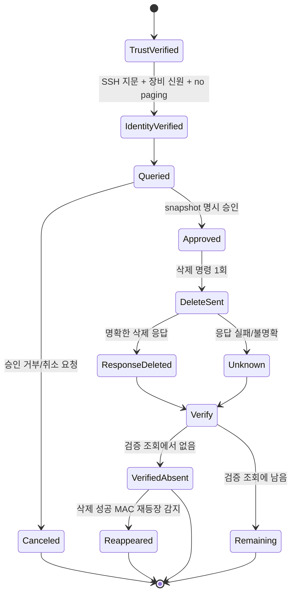

# 변경 명령 안전 모델

Aruba MM Session Cleanup은 실제 사용자 세션을 삭제하는 변경 명령을 사용합니다. 따라서 안전성은 UI 경고보다 **실행 상태 전이와 재시도 정책**으로 보장해야 합니다.

## 핵심 원칙

1. **연결 대상을 먼저 증명한다.**
   - 앱 known_hosts의 승인된 SSH 키만 허용하며 키 변경은 차단합니다.
   - MM/Mobility Conductor/WLC 신원과 페이징 해제를 확인하지 못하면 중단합니다.

2. **대상을 먼저 고정하고 승인받는다.**
   - 최초 Role 조회에서 parser가 채택한 MAC만 삭제 대상이 됩니다.
   - 이후 검증 조회에서 새로 발견된 MAC을 현재 batch에 추가하지 않습니다.
   - 즉시·주기 실행 모두 snapshot을 보여 주고 매번 명시 승인을 받습니다.

3. **한 MAC에 대한 변경 명령은 한 번만 전송한다.**
   - `aaa user delete mac <mac>` 호출은 `retry_once=False`입니다.
   - timeout·세션 단절·응답 파싱 실패를 근거로 같은 변경 명령을 자동 재전송하지 않습니다.

4. **응답 불확실성을 성공으로 추정하지 않는다.**
   - 장비 응답이 명확하지 않으면 `unknown / 확인 필요` 상태로 남깁니다.

5. **최종 성공은 사후 조회와 함께 판단한다.**
   - 삭제 batch 종료 후 같은 Role을 다시 조회합니다.
   - MAC이 사라졌는지 확인해 결과 상태를 갱신합니다.

6. **재등장은 자동 재삭제하지 않는다.**
   - 성공으로 기록된 MAC이 검증 조회에 다시 보이면 `reappeared`로 기록합니다.
   - 재접속·정책 재적용·인증 흐름 등 원인 확인을 위해 자동 재삭제를 금지합니다.

## 상태 전이



## 취소 경계

취소는 이미 전송된 명령을 되돌리지 않습니다. 대신 다음 안전 지점에서 추가 변경을 중단합니다.

- 삭제 시작 전 countdown
- target snapshot 승인 대기
- 다음 MAC 삭제 전
- 삭제 batch 종료 후 검증 조회 시작 전

취소 확인 자체가 실패하면 안전한 방향으로 작업을 중단하도록 처리합니다.

## 왜 삭제 명령을 재시도하지 않는가

네트워크 timeout은 장비가 명령을 실행하지 않았다는 증거가 아닙니다.

```text
명령 전송
   ↓
장비가 삭제 수행
   ↓
응답 패킷 유실 / SSH 세션 종료
   ↓
클라이언트는 timeout으로 관측
```

이 상황에서 자동 retry를 하면 동일한 변경 의도를 다시 전송하게 됩니다. 조회 명령은 재시도할 수 있어도 **파괴적 변경 명령은 동일한 재시도 정책을 사용하면 안 됩니다.**

## Parser 안전 경계

삭제 명령에 들어가는 MAC은 `normalize_mac()`을 통과해야 합니다. Parser가 사용자 항목으로 채택한 필드만 사용하며 BSSID/AP 등 다른 MAC-like 값은 target snapshot에 포함하지 않습니다.

Role은 영문·숫자로 시작하는 최대 64자의 제한된 문자 집합만 허용합니다. Host, 계정, 포트, timeout도 공통 validator를 거치므로 조회 명령이나 접속 매개변수에 임의 제어 문자열을 전달하지 않습니다.

## 인터페이스별 승인 경계

- GUI: 최초 지문은 별도 확인 대화상자, 대상은 `DELETE N` 입력 대화상자로 승인합니다. 주기 실행도 매 회 다시 묻습니다.
- Web UI: `127.0.0.1`에만 bind하고 loopback Host, CSRF token, 요청 크기, `TRUST`/`DELETE N`을 확인합니다. 미리보기 뒤 실행 시 fresh query 결과가 원래 snapshot과 같아야 합니다.
- CLI: password 인자를 받지 않고 `getpass`로 입력합니다. 최초 지문은 `TRUST`, 대상은 `DELETE N`을 입력해야 합니다.

## 감사 자료

`cleanup_summary.json`과 `deletion_history.jsonl`에는 변경 결과와 판정 상태가 기록됩니다. 다만 로컬 감사 파일 저장 실패는 네트워크 변경 명령 재시도의 근거가 되지 않습니다.

## 운영자가 확인해야 하는 사항

자동화가 대신 판단하지 않는 영역입니다.

- 해당 Role을 정리해도 되는 운영 시점인지
- 대상 MM/Managed Device가 맞는지
- 삭제 후 단말이 다시 인증될 가능성이 있는지
- `reappeared`가 정상 재접속인지 정책 문제인지
- 실제 장비/펌웨어의 CLI 응답이 테스트 fixture와 동일한지
