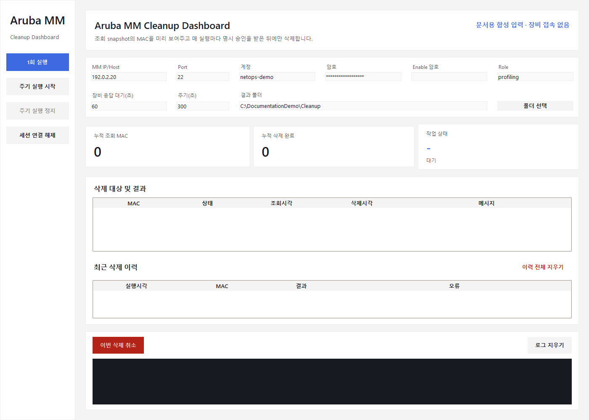
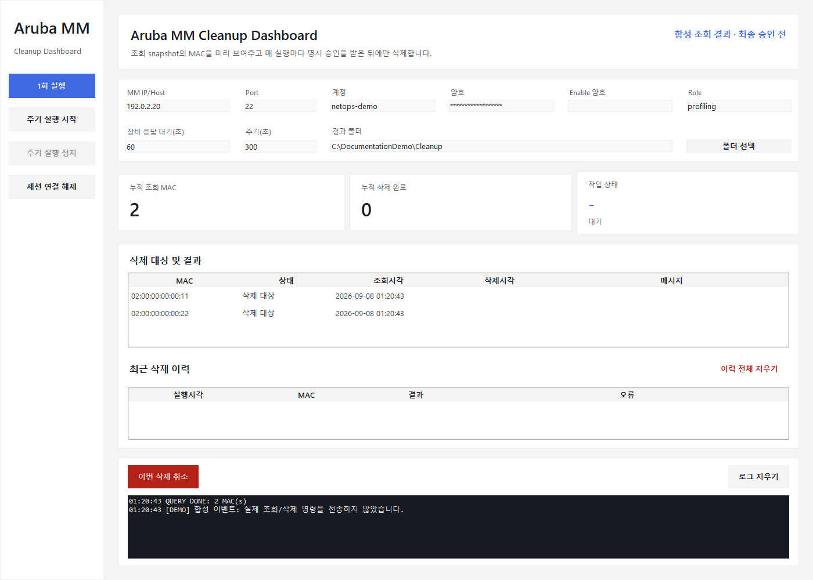
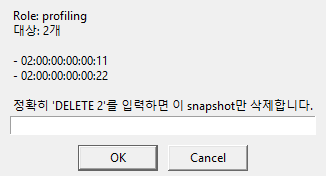
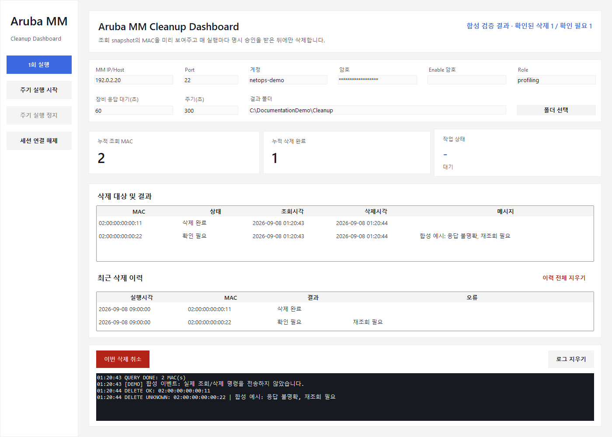

# 화면으로 따라가는 세션 정리 승인·검증

현재 Tk 앱에 문서용 합성 이벤트를 넣어 캡처했다. 실제 승인 대화상자는 표시한 뒤 **취소**했다. 마지막 결과는 승인 화면과 별도로 주입한 합성 예시이며 실제 조회·삭제·재조회 실행 결과가 아니다. 캡처 도구는 소켓 연결 시도를 차단한다.

## 1. 정리 범위와 실행 간격 확인

- **행동:** MM 주소, SSH 포트, 계정, Role, 응답 대기, 실행 간격과 결과 폴더를 확인한다.
- **읽을 값:** `192.0.2.20`, `netops-demo`, Role `profiling`은 문서용 합성 입력이다.
- **주의·다음 행동:** 실제 실행 전에 대상과 삭제 권한을 확인한다. 주기 실행도 매 실행마다 새 조회 snapshot과 명시적 승인이 필요하다. 캡처에서 실행 버튼은 누르지 않았다.

## 2. 조회 결과의 MAC 목록 확인

- **행동:** 삭제 대상 표에서 Role에 해당하는 MAC 목록과 건수를 대조한다.
- **읽을 값:** `02:00:00:00:00:11`, `02:00:00:00:00:22`는 가상 MAC 두 개다. 누적 조회와 현재 대상이 같은 의미인지 구분한다.
- **주의·다음 행동:** Type=N/A 등 별도 확인 안내가 있으면 관리자에게 장비 지정을 확인한다. 대상이 예상과 다르면 승인하지 않는다.

## 3. 정확한 snapshot만 최종 승인

- **행동:** Role·MAC 목록·개수를 다시 확인한다. 운영자가 의도한 대상과 일치할 때만 요구 문구를 입력한다.
- **읽을 값:** 이 합성 예시는 `DELETE 2`를 요구한다. 승인 대상은 이 시점의 두 MAC snapshot이다.
- **주의·다음 행동:** 이 문서는 승인을 대신하지 않는다. 캡처 도구는 아무 문구도 입력하지 않고 Cancel을 호출했으며 `approved=False`를 확인한다. 아래 결과는 별도 합성 상태 설명이다.

## 4. 확인된 삭제와 확인 필요를 구분

- **행동:** 대상 표·최근 삭제 이력·로그를 연결해 확인된 결과와 불확실 결과를 구분한다.
- **읽을 값:** 첫 MAC은 합성 `verified_deleted`, 두 번째는 `unknown`이다. 누적 삭제 완료 1은 두 대상 모두 삭제되었다는 의미가 아니다.
- **주의·다음 행동:** 응답 불명확·재조회됨·검증 생략은 성공으로 간주하지 않는다. 해당 실행의 감사 JSON/이력 JSONL을 보며 현재 상태를 확인한 뒤 다음 조치를 결정한다. [사용자 가이드](USER_GUIDE_KO.md), [안전 모델](SAFETY_MODEL.md)을 함께 읽는다.

## 캡처 출처와 재현

- 패키지 버전: `0.2.0`. 캡처 OS: Windows GitHub Actions/Python 3.11, 실제 Tk 창과 승인 팝업의 PrintWindow 캡처.
- 캡처 소스 SHA: `b66254faf623c15ab60b3898dff436000f1e1baf`. [Windows 캡처 실행](https://github.com/sebia1993/aruba-mm-session-cleanup/actions/runs/34176299430).
- 전체 메타데이터와 PNG SHA-256: [capture-manifest.json](images/capture-manifest.json).
- 도구: [capture_usage_screenshots.py](../tools/capture_usage_screenshots.py), [창 캡처 helper](../tools/capture_windows.py), [Windows workflow](../.github/workflows/docs-screenshots.yml).
- 실제 제품 GUI 핸들러에 합성 조회·삭제·검증 모델을 주입한다. MmCleanupRunner는 실행하지 않는다. 기존 사용자 이력은 읽지 않도록 임시 출력 폴더를 주입한다.
- 캡처용 Pillow는 workflow에만 설치한다. 제품 런타임 의존성은 추가하지 않는다.

Windows에서 잠금 의존성과 캡처용 Pillow 설치 후 `python tools/capture_usage_screenshots.py --output artifacts/docs-screenshots`로 재현한다. macOS에서 기본 창을 여는 것과 Windows GUI·패키지 검증은 구분한다. 합성 UI 그림은 실제 장비 삭제 성공·운영 안정성을 증명하지 않는다.
